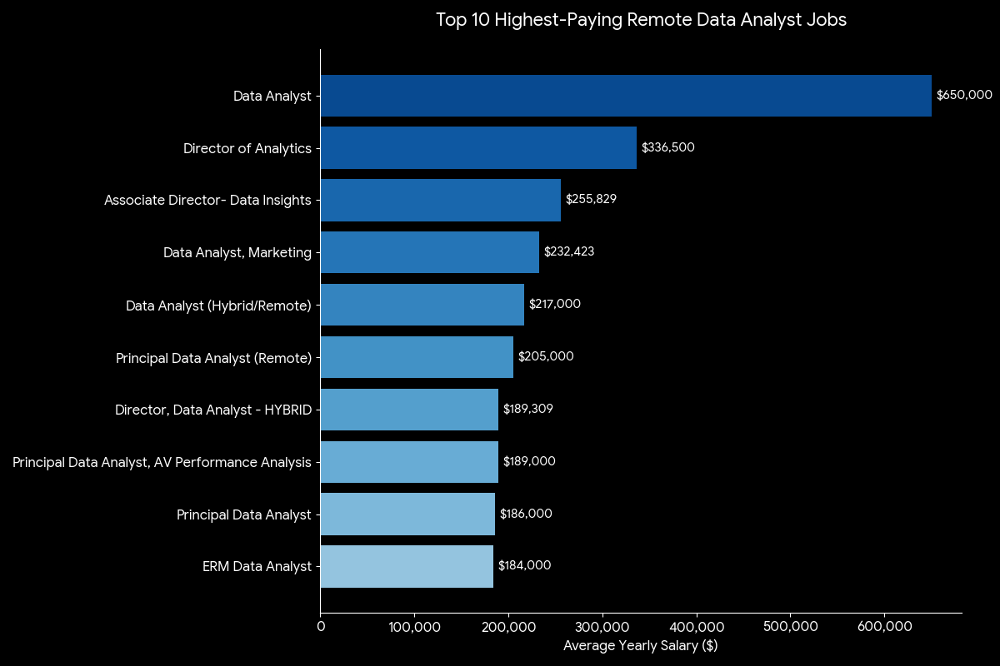
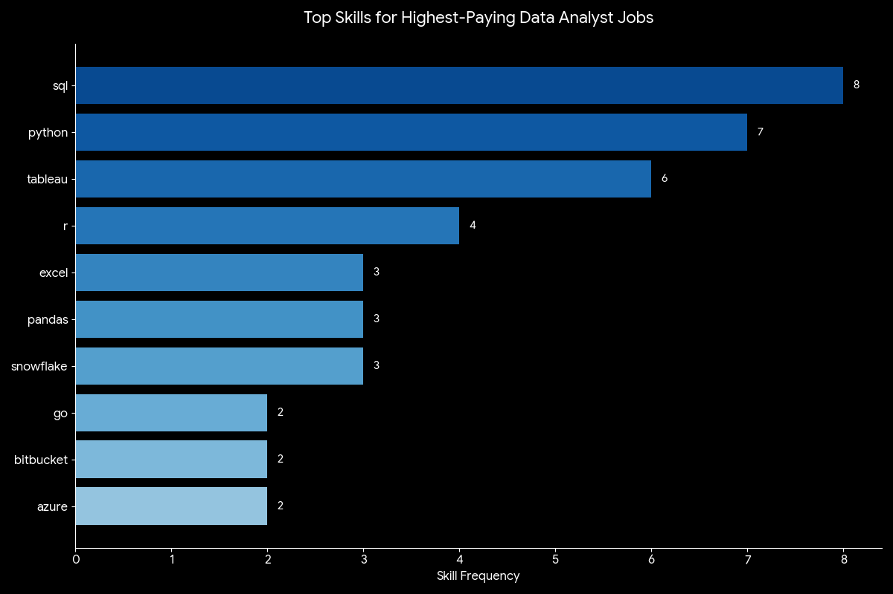

# Introduction

As an accounting student, I have learned that numbers tell a story, but I wanted to understand how to query the sources behind those numbers. This project was driven by a desire to move beyond financial statements and analyze the data analyst job market using **SQL**.

While my primary focus remains in finance and accounting, I created this project to develop core data analytics skills and gain hands-on experience working with large, real-world datasets. Through this analysis, I explored:

- 💰 **Top-paying data analyst roles** — Where are the highest salaries?  
- 🔥 **Most in-demand skills** — Which skills appear most frequently in job postings?  
- 📈 **The "sweet spot"** — Where does high demand intersect with high pay?  


🔍 **Interested in the logic?** View the SQL queries in the *[project_sql](/project_sql/)* folder.

# Background
The data for this project is sourced from Luke Barousse's *[SQL for Data Analytics](https://www.lukebarousse.com/sql)* course. It includes a large 2023 dataset containing job titles, salaries, locations, and associated skills, all of which remain highly relevant to today's data analytics job market.

### Through this project, I set out to answer five key questions:

1. What are the top-paying data analyst roles?
2. Which skills are required for these top-paying roles?
3. Which skills are in the highest demand for data analysts?
4. Which skills are associated with higher salaries?
5. What are the most optimal skills to learn?

# Tools I Used

- **SQL:** Used to explore the dataset and extract insights from 700,000+ entries.
- **PostgreSQL:** The database management system chosen for efficiently handling large datasets.
- **Visual Studio Code:** The integrated development environment (IDE) used for writing and executing queries.
- **Git and GitHub:** Used for version control and professional project sharing.
- **ChatGPT and Gemini:** Assisted with troubleshooting, query optimization, and synthesizing results.

# Analysis
Each query in this project investigates a different aspect of the data analyst job market. Below is how I approached each question:

### 1. Top-Paying Data Analyst Jobs
To identify the highest-paying roles, I filtered data analyst positions by average yearly salary, focusing on remote ("Anywhere") opportunities. This query highlights the **top 10 most lucrative positions**, showcasing significant earning potential across remote roles.

```sql
SELECT
    job_id,
    job_title,
    job_location,
    job_schedule_type,
    salary_year_avg,
    job_posted_date,
    name AS company_name
FROM
    job_postings_fact jpf
LEFT JOIN company_dim cd ON jpf.company_id = cd.company_id
WHERE
    job_title_short = 'Data Analyst' 
    AND job_location = 'Anywhere' 
    AND salary_year_avg IS NOT NULL
ORDER BY
    salary_year_avg DESC
LIMIT 10;
```
**Insights from the Top 10 Data Analyst Jobs in 2023:**
- **Wide Salary Range:** Top salaries range from approximately $184,000 to $650,000. While the top result is a significant outlier, the remaining nine roles fall between $186,000 and $336,500, representing a robust earning bracket.
- **Role Diversity:** Highest-paying roles span industries such as marketing (**Pinterest**), healthcare (**UCLA Health Careers**), and communications (**AT&T**), highlighting that data expertise is valued across sectors.
- **Full-Time Stability:** All 10 top-paying roles are full-time positions, suggesting that the most lucrative opportunities typically involve long-term commitments rather than contract work.


*bar graph visualizing the top 10 salaries for data analyst positions; created by Gemini from SQL query results*

### 2. Skills for Top-Paying Jobs

By joining the highest-paying jobs with the specific skills required for each, this query identifies the technical skills **most valued by top-paying companies.** The breakdown provides a clear view of which tools and programming languages are essential for securing top remote data analyst positions.

```sql
WITH top_paying_jobs AS (
    SELECT
        job_id,
        job_title,
        salary_year_avg,
        name AS company_name
    FROM
        job_postings_fact jpf
    LEFT JOIN company_dim cd ON jpf.company_id = cd.company_id
    WHERE
        job_title_short = 'Data Analyst' 
        AND job_location = 'Anywhere' 
        AND salary_year_avg IS NOT NULL
    ORDER BY
        salary_year_avg DESC
    LIMIT 10
)
SELECT
    t.*,
    skills
FROM 
    top_paying_jobs t
INNER JOIN skills_job_dim sj ON t.job_id = sj.job_id
INNER JOIN skills_dim sd ON sj.skill_id = sd.skill_id
ORDER BY 
    salary_year_avg DESC;
```

**Key Takeaways from the Top Skills for High-Paying Data Analyst Jobs in 2023:**

- **SQL is Essential:** Appearing in 100% of the top roles with listed skills (8 out of 8), **SQL** remains a foundational skill for high-paying data positions.
- **Programming & Visualization:** **Python** (7/8) and **Tableau** (6/8) follow closely, signaling that the ability to both process data and communicate insights is a driver for increased compensation.
- **Strategic Insight:** While technical skills like **SQL** dominate, the variety of secondary tools suggests that the highest-paying roles value flexible analysts who can adapt to the strategic needs of the business.


*bar graph visualizing the frequency of skills for the top 10 highest-paying data analyst roles; created by Gemini from SQL query results*

### 3. In-Demand Skills for Data Analysts
This query counts job postings with explicitly listed skills to identify the **top 5 most in-demand skills** across all remote data analyst roles. Understanding which skills appear most frequently in employer postings helps candidates prioritize learning skills that align with market demand.

```sql
SELECT
    skills,
    COUNT(jpf.job_id) AS demand_count
FROM 
    job_postings_fact jpf
INNER JOIN skills_job_dim sj ON jpf.job_id = sj.job_id
INNER JOIN skills_dim sd ON sj.skill_id = sd.skill_id
WHERE 
    job_title_short = 'Data Analyst' 
    AND job_work_from_home = TRUE
GROUP BY 
    skills
ORDER BY 
    demand_count DESC
LIMIT 5;
```

**Insights from Top In-Demand Skills for Remote Data Analysts:**
- **Data Foundation:** **SQL** is the most in-demand skill by a wide margin, appearing in 7,291 remote job postings, reinforcing its role as a foundational requirement for data analysts.
- **Spreadsheets:** Despite the growing emphasis on advanced programming, **Excel** remains the second most requested skill (4,611 postings), highlighting its continued importance in day-to-day analytical work.
- **Data Visualization:** Tools such as **Tableau** (3,745) and **Power BI** (2,609) rank among the top 5, indicating strong employer demand for analysts who can effectively communicate insights.

| skills    | demand_count |
|-----------|-------------:|
| SQL       | 7,291        |
| Excel     | 4,611        |
| Python    | 4,330        |
| Tableau   | 3,745        |
| Power BI  | 2,609        |

*table showing the 5 most frequently requested skills in data analyst job postings*

### 4. Skills Associated with Higher Salaries
This query calculates the **average salary associated with each skill** for remote data analyst positions. By focusing on roles with explicitly listed salaries and ranking them by salary averages, it highlights which technical skills are associated with higher compensation.

```sql
SELECT
    skills,
    ROUND(AVG(salary_year_avg), 0) AS avg_salary
FROM 
    job_postings_fact jpf
INNER JOIN skills_job_dim sj ON jpf.job_id = sj.job_id
INNER JOIN skills_dim sd ON sj.skill_id = sd.skill_id
WHERE 
    job_title_short = 'Data Analyst'
    AND salary_year_avg IS NOT NULL
    AND job_work_from_home = TRUE
GROUP BY 
    skills
ORDER BY 
    avg_salary DESC
LIMIT 25;
```

**Insights from Skills Ranked by Salary:**

- **Big Data:** **PySpark** commands the highest average salary at $208,172, approximately $19,000 above **Bitbucket** ($189,155), showing that large-scale data processing skills are highly valued for remote data analysts.
- **Machine Learning & AI:** Platforms such as **Watson** ($160,515) and **DataRobot** ($155,486) appear among the top-paying skills, indicating that expertise in applied AI can provide compensation advantages.
- **Other Notable Skills:** Tools like **GitLab** ($154,500), **Jupyter** ($152,777), and **Pandas** ($151,821) indicate the importance of version control, coding, and data manipulation in highly compensated roles.

| skills         | avg_salary |
|----------------|-----------:|
| PySpark        | $208,172 |
| Bitbucket      | $189,155 |
| Couchbase      | $160,515 |
| Watson         | $160,515 |
| DataRobot      | $155,486 |
| GitLab         | $154,500 |
| Swift          | $153,750 |
| Jupyter        | $152,777 |
| Pandas         | $151,821 |
| Elasticsearch  | $145,000 |

*table showing the top 10 highest-paying skills for remote data analyst roles, ranked by average annual salary*

### 5. Optimal Skills to Learn for Data Analysis
The final query combines **demand** and **average salary** for each skill to highlight skills that are both **commonly requested** and **well-compensated.** It helps job seekers prioritize skills that are likely to maximize career opportunities and earning potential.

```sql
SELECT
    sd.skills,
    COUNT(jpf.job_id) AS demand_count,
    ROUND(AVG(salary_year_avg), 0) AS avg_salary
FROM
    job_postings_fact jpf
INNER JOIN skills_job_dim sj ON jpf.job_id = sj.job_id
INNER JOIN skills_dim sd ON sj.skill_id = sd.skill_id
WHERE
    job_title_short = 'Data Analyst'
    AND salary_year_avg IS NOT NULL
    AND job_work_from_home = TRUE
GROUP BY
    sd.skill_id
HAVING
    COUNT(jpf.job_id) > 25
ORDER BY
    avg_salary DESC,
    demand_count DESC
LIMIT 25;
```
**Key Insights on Optimal Skills for Data Analysts:**

- **Programming & Analysis:** Skills like **Python** ($101,397) and **R** ($100,499) are in high demand, showing that coding proficiency remains essential for well-compensated, in-demand roles.
- **Cloud & Data Platforms:** Tools such as **AWS** ($108,317), **Azure** ($111,225), and **Snowflake** ($112,948) indicate the value of experience with modern cloud providers and data platforms.
- **Visualization & Reporting:** Tools like **Tableau** ($99,288) and **Looker** ($103,795) reinforce the importance of presenting and interpreting data for business decisions.

| skills    | demand_count | avg_salary |
| --------- | -----------: | ---------: |
| Go        |           27 |   $115,320 |
| Snowflake |           37 |   $112,948 |
| Azure     |           34 |   $111,225 |
| AWS       |           32 |   $108,317 |
| Oracle    |           37 |   $104,534 |
| Looker    |           49 |   $103,795 |
| Python    |          236 |   $101,397 |
| R         |          148 |   $100,499 |
| Tableau   |          230 |    $99,288 |
| SAS       |           63 |    $98,902 |

*table showing the top 10 skills with both high demand and above-average salary for remote data analyst roles*

# What I Learned

Beyond just writing SQL queries, this project strengthened my ability to think like a data analyst. I learned that effective analysis involves translating broad questions into analytical steps. Some of the key SQL skills I developed include:

- 🏗️ **Query Crafting:** Designing multi-table queries with `JOINs` and `CTEs` (Common Table Expressions) to extract insights from over 700,000 records.  
- 🧩 **Data Aggregation:** Applying `GROUP BY`, `COUNT()`, and `AVG()` functions to uncover patterns and summarize trends in large-scale datasets.  
- 🔍 **Filtering & Conditional Logic:** Using `WHERE` and `HAVING` clauses alongside `ORDER BY` and `LIMIT` to isolate relevant data and generate actionable insights.  

# Conclusion
This project served as a bridge between my background in accounting and the world of data analysis, and it demonstrates how SQL can be used not only to extract data but to derive practical career insights. By utilizing joins across tables, aggregations, and targeted filters, I transformed a raw dataset with over 700,000 entries into structured insights about the data analyst job market.

### Future Work
Further analysis could explore salary disparities by geographic location, compare compensation and skill demand across different data science roles (e.g., data scientist or data engineer), and examine trends over time to identify shifts in the job market.  